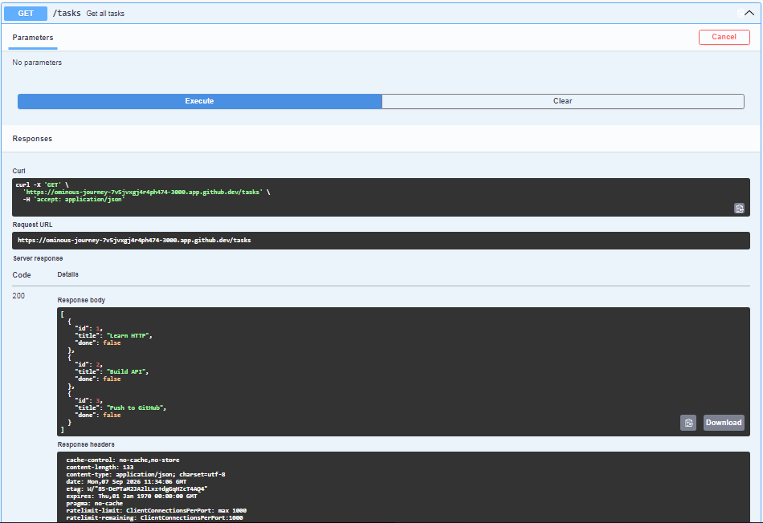
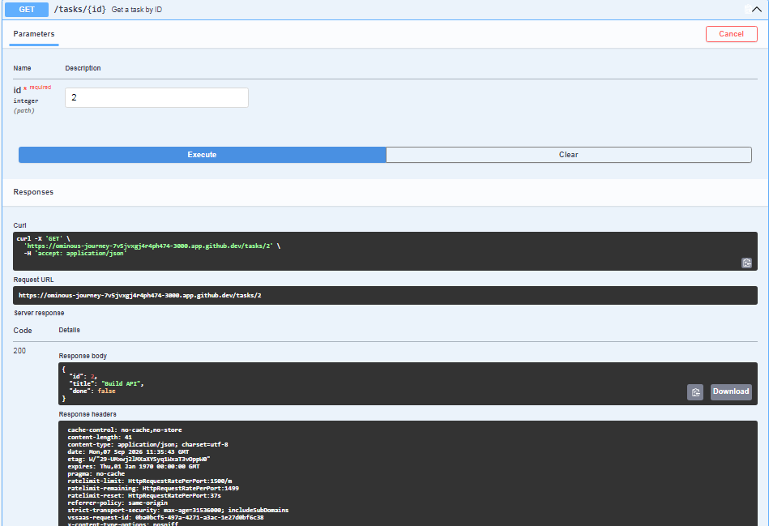
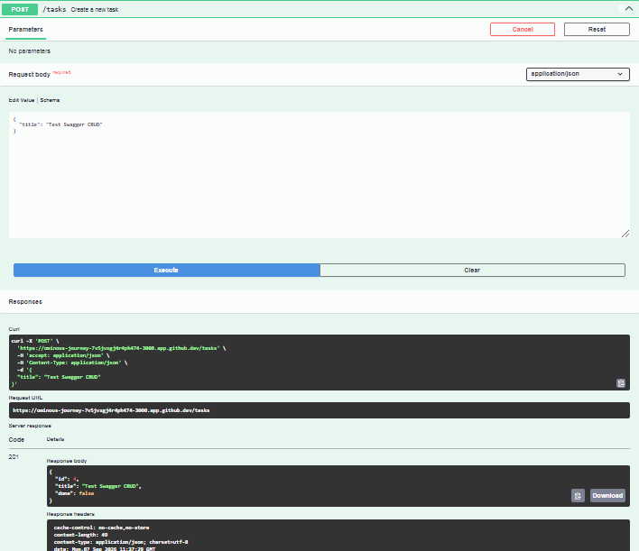
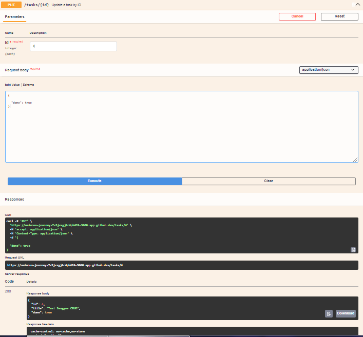
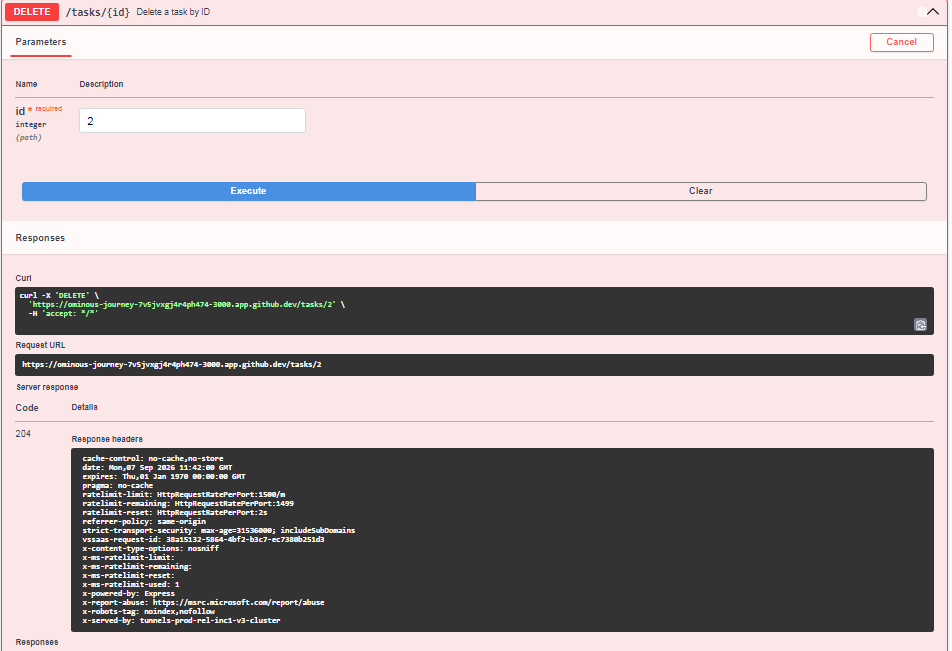
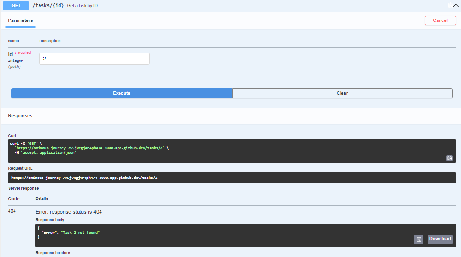
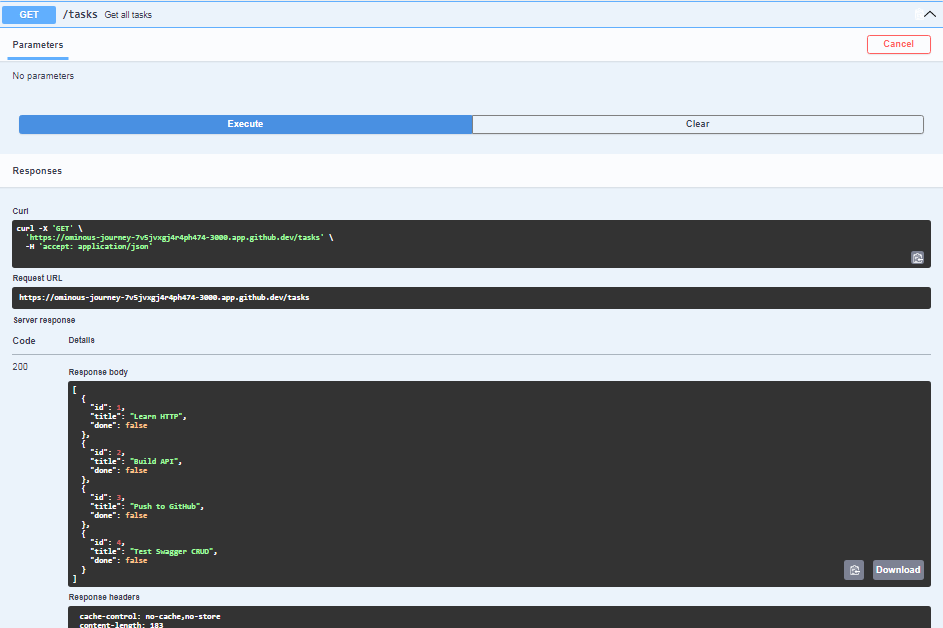

# 🚀 To-Do REST API

A simple **in-memory REST API** for managing tasks, built with **Node.js and Express.js**.

This project implements complete **CRUD operations** with request validation, proper HTTP status codes, Swagger UI documentation, API testing with `curl`, and Git/GitHub workflow.

---

## ✨ Features

- ✅ Create a new task
- ✅ Get all tasks
- ✅ Get a task by ID
- ✅ Update a task
- ✅ Delete a task
- ✅ Request body validation
- ✅ 404 handling for unknown tasks
- ✅ Proper HTTP status codes
- ✅ Interactive Swagger UI documentation
- ✅ API testing using Swagger UI and curl
- ✅ In-memory task storage
- ✅ Next free ID generation

> **Note:** Tasks are stored only in memory. Restarting the server resets the task data. This is intentional for this assignment.

---

## 🛠️ Tech Stack

- **Node.js**
- **Express.js**
- **JavaScript**
- **Swagger UI**
- **OpenAPI 3.0**
- **dotenv**
- **Git & GitHub**

---

## 📂 Project Structure

```text
To-Do-REST-API-Design/
│
├── docs/
│   ├── delete-tasks-id.PNG
│   ├── delete-tasks-id-verify.PNG
│   ├── get-tasks.PNG
│   ├── get-tasks-after-post.PNG
│   ├── get-tasks-id.PNG
│   ├── post-tasks.PNG
│   ├── put-tasks-id.PNG
│   └── UI.PNG
│
├── app.js
├── swaggerSpec.js
├── package.json
├── package-lock.json
├── .gitignore
└── README.md
```

---

# ⚙️ Installation

## 1. Clone the repository

```bash
git clone <YOUR_GITHUB_REPOSITORY_URL>
```

## 2. Navigate to the project directory

```bash
cd To-Do-REST-API-Design
```

## 3. Install dependencies

```bash
npm install
```

---

# ▶️ Run the Server

Start the server using:

```bash
node app.js
```

The API will run on:

```text
http://localhost:3000
```

---

# 📚 Swagger API Documentation

Interactive API documentation is available at:

```text
http://localhost:3000/docs
```

Swagger UI provides an interactive interface where all CRUD endpoints can be explored and tested using **Try it out**.

## Swagger UI Overview


---

# 🔗 API Endpoints

| Method | Endpoint | Description | Success Status |
|--------|----------|-------------|----------------|
| GET | `/` | Get API information | `200` |
| GET | `/health` | Check API health | `200` |
| GET | `/tasks` | Get all tasks | `200` |
| GET | `/tasks/:id` | Get a task by ID | `200` |
| POST | `/tasks` | Create a new task | `201` |
| PUT | `/tasks/:id` | Update a task | `200` |
| DELETE | `/tasks/:id` | Delete a task | `204` |

---

# 📝 Task Object

Each task has the following structure:

```json
{
  "id": 1,
  "title": "Learn HTTP",
  "done": false
}
```

### Task Fields

| Field | Type | Description |
|-------|------|-------------|
| `id` | Integer | Unique task ID |
| `title` | String | Task title |
| `done` | Boolean | Task completion status |

---

# 🧪 API Examples

## 1. Get All Tasks

### Request

```bash
curl -i http://localhost:3000/tasks
```

### Response

```json
[
  {
    "id": 1,
    "title": "Learn HTTP",
    "done": false
  },
  {
    "id": 2,
    "title": "Build API",
    "done": false
  },
  {
    "id": 3,
    "title": "Push to GitHub",
    "done": false
  }
]
```

### Swagger Test



---

# 2. Get Task by ID

### Request

```bash
curl -i http://localhost:3000/tasks/3
```

### Example Response

```json
{
  "id": 3,
  "title": "Push to GitHub",
  "done": false
}
```

### Swagger Test



---

# 3. Create a New Task

### Request

```bash
curl -i -X POST http://localhost:3000/tasks \
-H "Content-Type: application/json" \
-d "{\"title\":\"Learn Swagger\"}"
```

### Example Response

```text
HTTP/1.1 201 Created
```

```json
{
  "id": 4,
  "title": "Learn Swagger",
  "done": false
}
```

### Swagger Test



---

# 4. Update a Task

The API supports partial updates, so either `title`, `done`, or both can be updated.

### Request

```bash
curl -i -X PUT http://localhost:3000/tasks/4 \
-H "Content-Type: application/json" \
-d "{\"done\":true}"
```

### Example Response

```text
HTTP/1.1 200 OK
```

```json
{
  "id": 4,
  "title": "Learn Swagger",
  "done": true
}
```

### Swagger Test



---

# 5. Delete a Task

### Request

```bash
curl -i -X DELETE http://localhost:3000/tasks/2
```

### Response

```text
HTTP/1.1 204 No Content
```

A successful delete returns an empty response body.

### Swagger Test



---

# 6. Verify Deleted Task

After deleting a task, requesting the same task ID should return `404 Not Found`.

### Request

```bash
curl -i http://localhost:3000/tasks/2
```

### Response

```text
HTTP/1.1 404 Not Found
```

```json
{
  "error": "Task 2 not found"
}
```

### Swagger Test



---

# 🔄 CRUD Flow

The complete CRUD flow implemented in this project is:

```text
             To-Do REST API
                    │
       ┌────────────┼────────────┐
       │            │            │
     Create        Read        Update
       │            │            │
     POST       GET /tasks    PUT /tasks/:id
       │            │            │
       └────────────┼────────────┘
                    │
                  Delete
                    │
              DELETE /tasks/:id
```

---

# ❌ Validation & Error Handling

The API validates request data and returns appropriate HTTP status codes.

| Status Code | Meaning |
|-------------|---------|
| `200` | Successful read or update |
| `201` | Task successfully created |
| `204` | Task successfully deleted |
| `400` | Invalid request body |
| `404` | Task not found |

---

## Invalid Create Request

Request:

```json
{}
```

Response:

```json
{
  "error": "Title is required"
}
```

Status:

```text
400 Bad Request
```

---

## Invalid Update Request

For example:

```json
{
  "done": "yes"
}
```

Response:

```text
400 Bad Request
```

The API only accepts a boolean value for `done`.

Valid:

```json
{
  "done": true
}
```

or:

```json
{
  "done": false
}
```

---

# 🧪 Testing Evidence

The API was tested using both **Swagger UI** and **curl**.

## GET All Tasks


---

## GET Task by ID


---

## POST Task


---

## GET Tasks After POST

The newly created task is also visible when fetching all tasks.



---

## PUT Task


---

## DELETE Task


---

## Verify Deleted Task


---

# 💾 Data Storage

This project uses an **in-memory JavaScript array** to store tasks.

```text
Client
   │
   ▼
Express REST API
   │
   ▼
In-Memory Tasks Array
```

There is no database or file-based persistence in this version.

Therefore, restarting the server resets the tasks to the initial data.

---

# 🔀 Git Development Stages

The project was developed incrementally through meaningful commits:

```text
Stage 0: hello server
        ↓
Stage 1: root and health endpoints
        ↓
Stage 2: read endpoints with 404
        ↓
Stage 3: create with validation
        ↓
Stage 4: full CRUD
        ↓
Stage 5: Swagger UI
        ↓
Stage 6: publish and docs
```

---

# 🎯 Learning Objectives

Through this project, I practiced:

- REST API fundamentals
- HTTP methods
- CRUD operations
- HTTP status codes
- JSON request and response handling
- Request body parsing
- Path parameters
- Input validation
- Express.js routing
- Swagger UI
- OpenAPI 3.0
- API testing with curl
- Git and GitHub
- Writing API documentation

---

# 👨‍💻 Author

**Md Anees Khan**

B.Tech Computer Science & Engineering Student
Maulana Azad National Urdu University

---

# ⭐ Project Status

**Completed**

The project implements the required CRUD API, validation, Swagger documentation, API testing, and Git/GitHub workflow.
