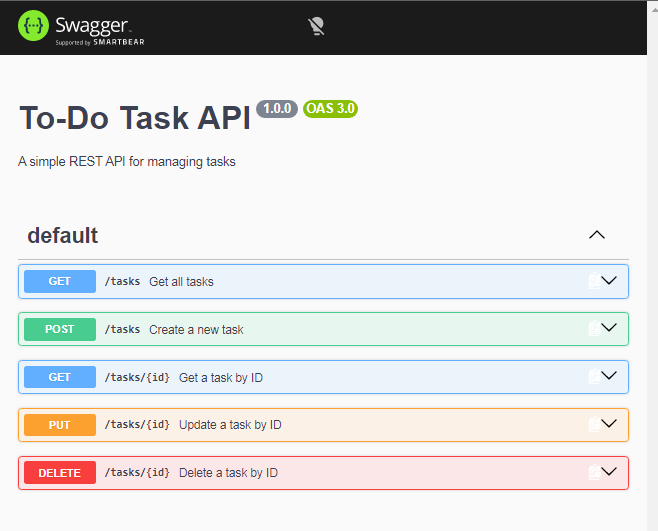
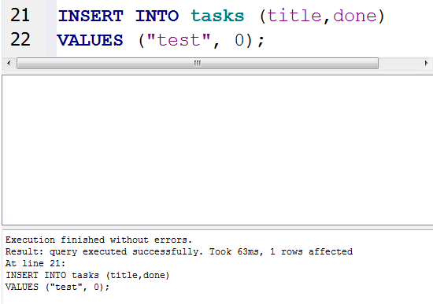
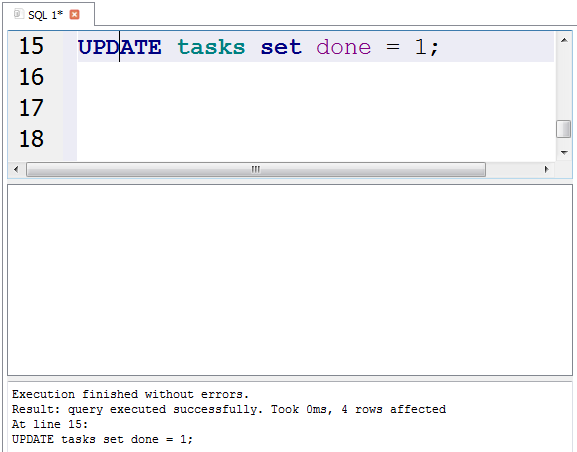
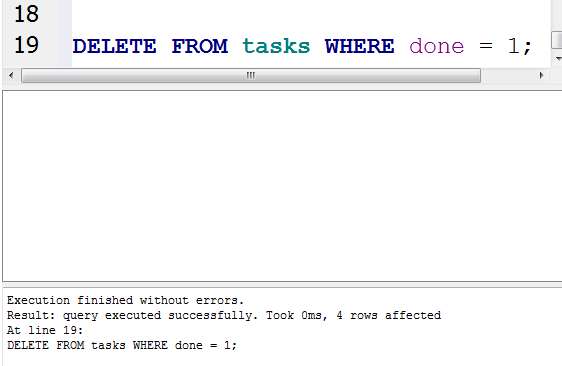
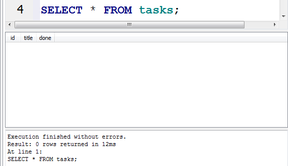

# 🚀 To-Do REST API

A simple **SQLite-backed REST API** for managing tasks, built with **Node.js and Express.js**.

This project implements complete **CRUD operations** with request validation, proper HTTP status codes, Swagger UI documentation, SQLite database persistence, API testing using Swagger UI and curl, and Git/GitHub workflow.

---

## ✨ Features

- ✅ Create a new task
- ✅ Get all tasks
- ✅ Get a task by ID
- ✅ Update a task
- ✅ Delete a task
- ✅ Request body validation
- ✅ 404 handling for unknown tasks
- ✅ Proper HTTP status codes
- ✅ SQLite database persistence
- ✅ Automatic database and table creation
- ✅ Automatic seed data on first run
- ✅ Parameterized SQL queries
- ✅ Interactive Swagger UI documentation
- ✅ API testing using Swagger UI and curl
- ✅ Data persists after server restart
- ✅ Git & GitHub workflow

---

## 🛠️ Tech Stack

- **Node.js**
- **Express.js**
- **JavaScript**
- **SQLite**
- **better-sqlite3**
- **Swagger UI**
- **OpenAPI 3.0**
- **dotenv**
- **Git & GitHub**

---

# 📂 Project Structure

```text
To-Do-REST-API-Design/
│
├── docs/
│   ├── delete-tasks-id.PNG
│   ├── delete-tasks-id-verify.PNG
│   ├── get-tasks.PNG
│   ├── get-tasks-after-post.PNG
│   ├── get-tasks-id.PNG
│   ├── post-tasks.PNG
│   ├── put-tasks-id.PNG
│   ├── UI.PNG
│   │
│   ├── alltasksAfterDelete.PNG
│   ├── delete.PNG
│   ├── insert.PNG
│   ├── update.PNG
│   └── AllTasks.PNG
│
├── app.js
├── db.js
├── swaggerSpec.js
├── package.json
├── package-lock.json
├── .gitignore
└── README.md
```

> **Note:** `tasks.db` is intentionally not included in Git. It is created automatically when the application starts.

---

# ⚙️ Installation

## 1. Clone the repository

```bash
git clone <YOUR_GITHUB_REPOSITORY_URL>
```

## 2. Navigate to the project directory

```bash
cd To-Do-REST-API-Design
```

## 3. Install dependencies

```bash
npm install
```

---

# ▶️ Run the Server

Start the server using:

```bash
node app.js
```

The API will run on:

```text
http://localhost:3000
```

On the first run, the application automatically:

1. Creates the SQLite database.
2. Creates the `tasks` table if it does not exist.
3. Inserts three seed tasks if the table is empty.

The database file is:

```text
tasks.db
```

---

# 💾 SQLite Database

## Why SQLite?

SQLite was chosen because it is lightweight, simple to set up, requires no separate database server, and stores the application's data in a single database file.

It is well suited for this project because it provides real database persistence without requiring a separate database service.

---

## Database Location

The SQLite database is stored in the project root:

```text
tasks.db
```

The database is created automatically by `db.js`.

The database file is intentionally **git-ignored** so that every fresh clone can create its own local database automatically.

---

## Database Schema

The project uses a `tasks` table with the following columns:

| Column | Type | Description |
|--------|------|-------------|
| `id` | INTEGER | Primary key and unique task ID |
| `title` | TEXT | Task title |
| `done` | BOOLEAN | Task completion status, stored as `0` or `1` |

---

## Automatic Seed Data

When the database is created for the first time, three example tasks are inserted:

```text
1. Learn HTTP
2. Build API
3. Push to GitHub
```

Seed data is inserted **only when the table is empty**.

Restarting the application does not insert duplicate seed tasks.

---

# 📚 Swagger API Documentation

Interactive API documentation is available at:

```text
http://localhost:3000/docs
```

Swagger UI provides an interactive interface where all CRUD endpoints can be explored and tested using **Try it out**.

## Swagger UI Overview



---

# 🔗 API Endpoints

| Method | Endpoint | Description | Success Status |
|--------|----------|-------------|----------------|
| GET | `/` | Get API information | `200` |
| GET | `/health` | Check API health | `200` |
| GET | `/tasks` | Get all tasks | `200` |
| GET | `/tasks/:id` | Get a task by ID | `200` |
| POST | `/tasks` | Create a new task | `201` |
| PUT | `/tasks/:id` | Update a task | `200` |
| DELETE | `/tasks/:id` | Delete a task | `204` |

---

# 📝 Task Object

Each task has the following structure:

```json
{
  "id": 1,
  "title": "Learn HTTP",
  "done": false
}
```

### Task Fields

| Field | Type | Description |
|-------|------|-------------|
| `id` | Integer | Unique task ID |
| `title` | String | Task title |
| `done` | Boolean | Task completion status |

> SQLite stores the `done` value as `0` or `1`, while the API represents it as a boolean.

---

# 🧪 API Examples

## 1. Get All Tasks

### Request

```bash
curl -i http://localhost:3000/tasks
```

### Example Response

```json
[
  {
    "id": 1,
    "title": "Learn HTTP",
    "done": false
  },
  {
    "id": 2,
    "title": "Build API",
    "done": false
  },
  {
    "id": 3,
    "title": "Push to GitHub",
    "done": false
  }
]
```

### Swagger Test


---

# 2. Get Task by ID

### Request

```bash
curl -i http://localhost:3000/tasks/3
```

### Example Response

```json
{
  "id": 3,
  "title": "Push to GitHub",
  "done": false
}
```

### Swagger Test


---

# 3. Create a New Task

### Request

```bash
curl -i -X POST http://localhost:3000/tasks \
-H "Content-Type: application/json" \
-d "{\"title\":\"Learn Swagger\"}"
```

### Example Response

```text
HTTP/1.1 201 Created
```

```json
{
  "id": 4,
  "title": "Learn Swagger",
  "done": false
}
```

### Swagger Test


---

# 4. Update a Task

The API supports partial updates, so either `title`, `done`, or both can be updated.

### Request

```bash
curl -i -X PUT http://localhost:3000/tasks/4 \
-H "Content-Type: application/json" \
-d "{\"done\":true}"
```

### Example Response

```text
HTTP/1.1 200 OK
```

```json
{
  "id": 4,
  "title": "Learn Swagger",
  "done": true
}
```

### Swagger Test


---

# 5. Delete a Task

### Request

```bash
curl -i -X DELETE http://localhost:3000/tasks/2
```

### Response

```text
HTTP/1.1 204 No Content
```

A successful delete returns an empty response body.

### Swagger Test


---

# 6. Verify Deleted Task

After deleting a task, requesting the same task ID should return `404 Not Found`.

### Request

```bash
curl -i http://localhost:3000/tasks/2
```

### Response

```text
HTTP/1.1 404 Not Found
```

```json
{
  "error": "Task 2 not found"
}
```

### Swagger Test


---

# 🔄 CRUD Flow

The complete CRUD flow implemented in this project is:

```text
                 Client
                   │
                   ▼
            Express REST API
                   │
                   ▼
             SQLite Database
                   │
        ┌──────────┼──────────┐
        │          │          │
      Create      Read      Update
        │          │          │
      POST      GET /tasks   PUT
        │          │          │
        └──────────┼──────────┘
                   │
                 Delete
                   │
             DELETE /tasks/:id
```

---

# 🗄️ Database Flow

```text
Client
   │
   ▼
Express REST API
   │
   ▼
Parameterized SQL Queries
   │
   ▼
SQLite
   │
   ▼
tasks.db
```

The API uses `better-sqlite3` to execute parameterized SQL queries against the SQLite database.

---

# ❌ Validation & Error Handling

The API validates request data and returns appropriate HTTP status codes.

| Status Code | Meaning |
|-------------|---------|
| `200` | Successful read or update |
| `201` | Task successfully created |
| `204` | Task successfully deleted |
| `400` | Invalid request body |
| `404` | Task not found |

---

## Invalid Create Request

Request:

```json
{}
```

Response:

```json
{
  "error": "Title is required"
}
```

Status:

```text
400 Bad Request
```

---

## Invalid Update Request

For example:

```json
{
  "done": "yes"
}
```

Response:

```text
400 Bad Request
```

The API only accepts a boolean value for `done`.

Valid:

```json
{
  "done": true
}
```

or:

```json
{
  "done": false
}
```

---

# 🔐 SQL Query Safety

The application uses **parameterized SQL queries** instead of directly concatenating user input into SQL statements.

For example:

```sql
SELECT * FROM tasks WHERE id = ?;
```

and:

```sql
INSERT INTO tasks (title, done) VALUES (?, ?);
```

Parameterized queries help prevent SQL injection and safely handle user-provided values.

---

# 🧪 Testing Evidence

The API was tested using **Swagger UI**, `curl`, and DB Browser for SQLite.

## GET All Tasks


---

## GET Task by ID


---

## POST Task


---

## GET Tasks After POST

The newly created task is also visible when fetching all tasks.


---

## PUT Task


---

## DELETE Task


---

## Verify Deleted Task


---

# 🖥️ SQLite Database Exploration

The SQLite database was explored using **DB Browser for SQLite**.

The following operations were performed:

- Viewing all tasks
- Inserting a task
- Updating task data
- Deleting a task
- Verifying the database after deletion

## Database View


---

## Insert Operation



---

## Update Operation



---

## Delete Operation



---

## Tasks After Delete



---

# 🔎 Example SQL Query

One example query used while exploring the database was:

```sql
SELECT * FROM tasks WHERE done = 1;
```

This query returns all completed tasks from the `tasks` table.

Other SQL operations used during database exploration included:

```sql
SELECT * FROM tasks;
```

```sql
SELECT COUNT(*) FROM tasks;
```

```sql
UPDATE tasks SET done = 1;
```

```sql
DELETE FROM tasks WHERE done = 1;
```

---

# 🔄 Data Persistence

Unlike the original in-memory version, this project now stores tasks in a SQLite database.

```text
Client
   │
   ▼
Express REST API
   │
   ▼
SQLite
   │
   ▼
tasks.db
```

Because the data is stored in `tasks.db`, tasks remain available after restarting the server.

The database, table, and seed data are created automatically when required.

---

# 🌱 Fresh Clone Setup

A fresh clone does not require an existing `tasks.db` file.

After cloning the repository:

```bash
git clone <YOUR_GITHUB_REPOSITORY_URL>
cd To-Do-REST-API-Design
npm install
node app.js
```

The application automatically creates:

```text
tasks.db
```

and the required `tasks` table.

If the table is empty, the application inserts the three initial seed tasks.

This makes the project reproducible on a fresh machine without manually creating the database.

---

# 🚫 Database File and Git

The `tasks.db` file is intentionally excluded from Git.

The `.gitignore` file contains:

```gitignore
tasks.db
```

This allows each clone of the repository to create and maintain its own local SQLite database.

---

# 🔀 Git Development Stages

The project was developed incrementally through meaningful commits.

## Assignment 1

```text
A1
│
├── Stage 0: hello server
├── Stage 1: root and health endpoints
├── Stage 2: read endpoints with 404
├── Stage 3: create with validation
├── Stage 4: full CRUD
├── Stage 5: Swagger UI
└── Stage 6: publish and docs
```

## Assignment 2 — SQLite Migration

```text
A2
│
├── Stage 0: create SQLite database
├── Stage 1: database read endpoints
├── Stage 2: insert into database
├── Stage 3: update and delete with SQL
├── Stage 4: explored SQLite
└── Stage 5: database documentation
```

---

# 🎯 Learning Objectives

Through this project, I practiced:

- REST API fundamentals
- HTTP methods
- CRUD operations
- HTTP status codes
- JSON request and response handling
- Request body parsing
- Path parameters
- Input validation
- Express.js routing
- Swagger UI
- OpenAPI 3.0
- API testing with curl
- SQLite database
- SQL queries
- Parameterized queries
- Database persistence
- Automatic database initialization
- Git and GitHub
- Writing API documentation

---

# 👨‍💻 Author

**Md Anees Khan**

B.Tech Computer Science & Engineering Student
Maulana Azad National Urdu University

---

# ⭐ Project Status

**Completed**

The project implements a complete SQLite-backed CRUD REST API with validation, Swagger documentation, API testing, database persistence, automatic database initialization, SQLite exploration, and Git/GitHub workflow.
